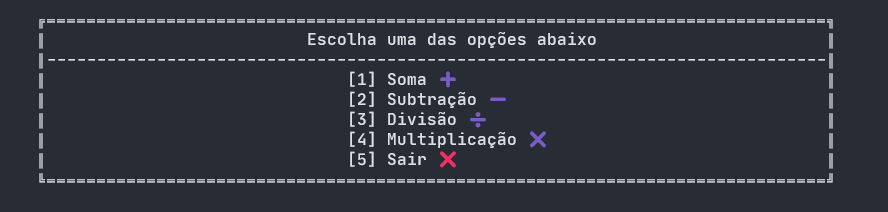

## Calculadora

Essa é uma calculadora em CLI que utilizei para praticar a linguagem C#

## Oque eu aprendi

- A sintaxe inicial da linguagen
- Imprimir uma mensagem na tela
- Ler a entrada de um usuário
- Fazer o Parse entre vários tipos de dados
- Utilizar o Switch
- Colorir mensagens na tela
- Passar uma função como parâmetro

## Licença
Este projeto está licenciado sob a Licença [MIT](LICENSE).