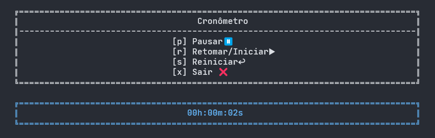

# Cronômetro

Esse é um cronômetro em CLI que usei para praticar a linguagem C#

## Oque eu aprendi

Além dos conhecimentos aprendidos em [Calculator](../Calculator/) aprendi:

- Verificar e ler uma tecla pressionada pelo usuário
- Como ler e tratar argumentos de linha de comando
- Manipular datas e horas em C#

## Requisitos para criar um cronômetro CLI em C#:

Esse requisitos foram gerados para eu ter uma noção de como fazer o cronômetro e saber onde buscar as informações.

1. **Interface de Linha de Comando (CLI)**:

   - O cronômetro deve ser executado a partir da linha de comando.
   - Deve aceitar argumentos para definir o tempo inicial e final.

2. **Funcionalidade do Cronômetro**:

   - Deve exibir o tempo decorrido a cada segundo.
   - Deve permitir pausar e retomar o cronômetro.
   - Deve permitir reiniciar o cronômetro.

3. **Controles do Usuário**:

   - `p` para pausar.
   - `r` para retomar.
   - `s` para parar e reiniciar.

4. **Saída**:

   - O tempo decorrido deve ser exibido no formato `hh:mm:ss`.

5. **Tratamento de Erros**:
   - Validar os argumentos de entrada.
   - Tratar exceções durante a execução.

   ## Licença
Este projeto está licenciado sob a Licença [MIT](LICENSE).
